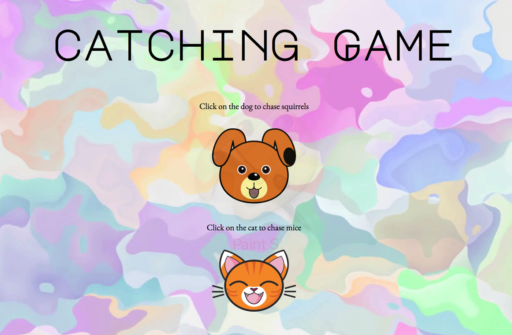

# LET'S PLAY CATCH!

## MVP

### Introduction

The goal of the game is that you catch all the mice that are running around in your kitchen floor. You have to run against time.
Who will be faster? You or the mice?

### Loosing Condition

You lose the game if you don't catch all the mice on time.

 **MVP Checklist:**
- [x] Have the mice run around
- [x] Set a timer
- [x] Set a value to each mouse
- [x] Have an accumulator that updates as the user captures the mice

### Screenshot of the initial gameboard post MVP
User can choose between chasing after mice (by choosing the cat), or chasing after squirrels (by choosing the dog).

### Post MVP

1. Find images for the dog part of the game
2. Change variables so the semantic matched with dog game

**CAT GAME VS DOG GAME**

### Code Snippet
To have the mice disappear once the time was over I defined an anonymous arrow function and then assign it to the removeMice variable.
This functions selects all of the mice nodes and assigns them to variables.
I then remove the mice using the .forEach to loop through a nodeList.

`  const removeMice = () => {
    let allMice = document.querySelectorAll('.mouse');
    let allCheese = document.querySelector('.mouseCheese');
    if (allCheese) {
    allCheese.remove();
  }
    allMice.forEach(mice => {
      mice.remove();
    });
  }
  return removeMice;
};`

I return the removeMice variable to access it outside of the createMouse function's scope.
The same idea was used in the dog.js 