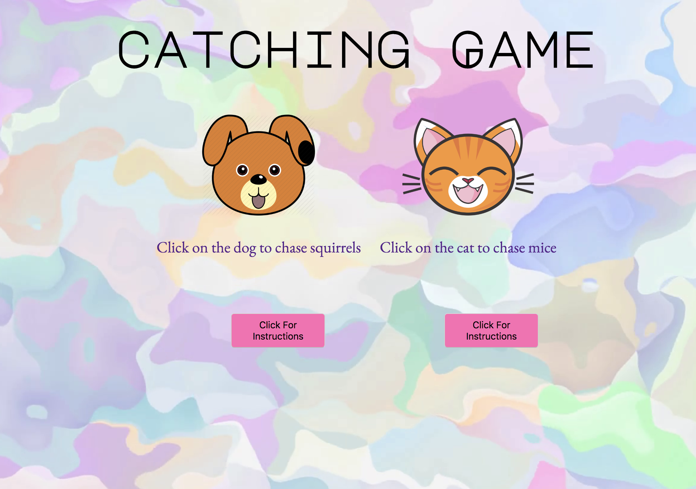

# LET'S PLAY CATCH!

## MVP

### Introduction

The goal of the game is that you catch all the mice that are running around in your kitchen floor. You have to run against time.
Who will be faster? You or the mice?

### Loosing Condition

You lose the game if you don't catch all the mice on time.

 ** MVP Checklist:**
- [x] Have the mice run around
- [x] Set a timer
- [x] Set a value to each mouse
- [x] Have an accumulator that updates as the user captures the mice

### Screenshot of the initial gameboard post MVP
User can choose between chasing after mice (by choosing the cat), or chasing after squirrels (by choosing the dog).

